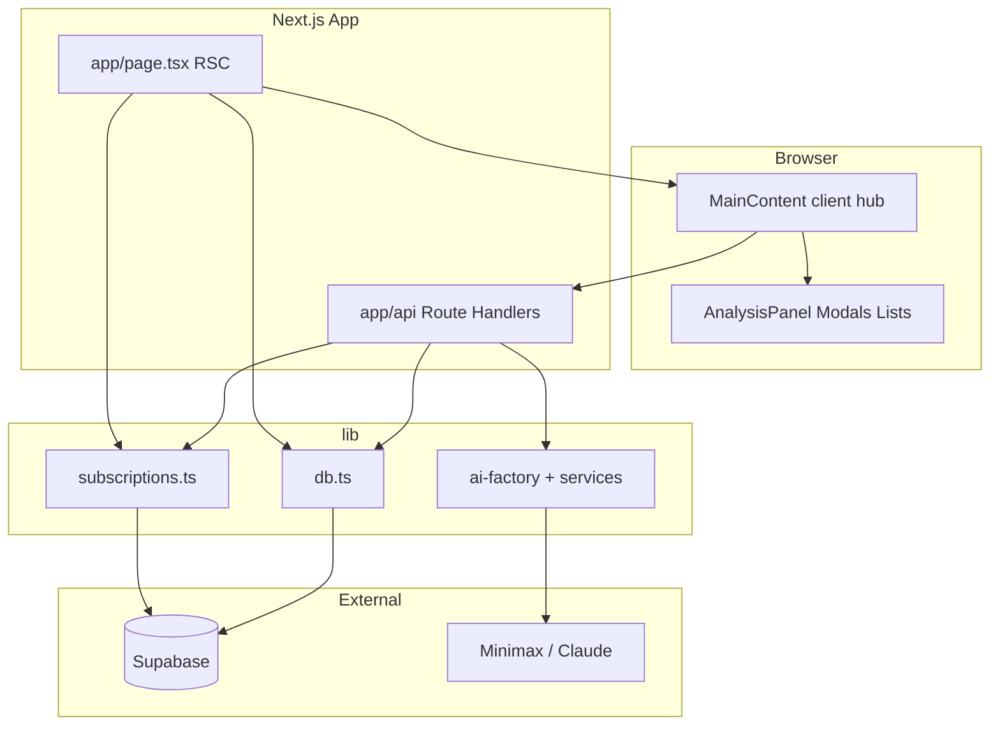

# ainews-v2 架构说明

面向新成员 onboarding：技术栈、数据流、路由与 API 索引。详细设计规范见仓库根目录 [CLAUDE.md](../CLAUDE.md)。

## 技术栈

| 层级 | 实现 |
|------|------|
| 框架 | Next.js 14 App Router |
| 身份 | Supabase Auth（[middleware.ts](../middleware.ts) 刷新 session） |
| 数据 | Supabase PostgreSQL（`news_items`、`sources`、订阅、书签等） |
| AI | Minimax / Claude，入口 [lib/ai/ai-factory.ts](../lib/ai/ai-factory.ts) |
| 样式 | Tailwind + [app/globals.css](../app/globals.css)，token 见 [tailwind.config.ts](../tailwind.config.ts) |

## 架构图



## 核心页面

| 路径 | 文件 | 说明 |
|------|------|------|
| `/` | [app/page.tsx](../app/page.tsx) | `getUser()` 后分支：个性化 feed（含访客默认 handles）或推荐流；注入 `MainContent` |
| `/login`、`/register` | `app/login`, `app/register` | 认证 |
| `/bookmarks` | [app/bookmarks/page.tsx](../app/bookmarks/page.tsx) | 需登录（middleware 保护） |
| `/news/[id]` | [app/news/[id]/page.tsx](../app/news/[id]/page.tsx) | 单条详情 |
| 登录拦截 | [app/@modal/(.)login/](../app/@modal/) | 并行路由 Modal |

## 客户端状态中枢

[components/MainContent.tsx](../components/MainContent.tsx) 集中管理：帖子列表、侧栏源、分类/源/搜索筛选、刷新任务、书签与订阅、INSIGHT 右栏（`/api/analysis`）。列表筛选为客户端 `useMemo`，不额外请求服务端。

## HTTP API 索引

| 方法 / 路径 | 职责 |
|-------------|------|
| `POST /api/analysis` | INSIGHT：AI 分析；`unstable_cache` 按 `postId` + 用户/访客 + 订阅列表签名缓存 24h；按 IP 进程内限流（见 [lib/analysis-rate-limit.ts](../lib/analysis-rate-limit.ts)） |
| `GET/POST /api/bookmarks` | 书签 |
| `GET/POST /api/subscriptions` | 订阅信息源 |
| `GET /api/me/subscribed-feed` | 当前用户订阅 feed |
| `GET /api/me/subscribed-sources` | 当前用户已订阅源 meta |
| `GET /api/sources` | 源列表等 |
| `POST /api/sources/fetch` | 触发拉取某源资料等 |
| `GET /api/recommended-sources` | 推荐关注源 |
| `POST /api/refresh` | 刷新流水线入口 |
| `POST /api/refresh/fetch` | 抓取阶段 |
| `POST /api/refresh/process` | 处理阶段 |
| `GET /api/task-status` | 任务状态轮询 |
| `POST /api/import-from-url` | 从 URL 导入 |
| `POST /api/debug-log` | 调试日志（开发向） |

**说明：** [middleware.ts](../middleware.ts) 的 matcher 排除 `api/`，各 Route Handler 自行处理鉴权与限流。

## 相关目录

```
app/           App Router 页面与 API
components/    UI 组件（扁平）
lib/           业务逻辑、DB、AI、订阅、类型（types.ts）
hooks/         React hooks
public/        静态资源
```

## 首页性能策略

- [app/page.tsx](../app/page.tsx) 使用 `export const dynamic = 'force-dynamic'`，因同一 URL 需按用户 session 返回个性化或推荐流，默认不做整页静态化。
- 若需降低 TTFB，可考虑：仅将匿名推荐区块 ISR、或边缘缓存 + 短 revalidate，与登录态片段组合（架构级改动）。

## TypeScript 与构建

- **`next build` 与 `ignoreBuildErrors`：** 当前 Next.js 14.2 生成的 `.next/types/**` 路由校验文件引用裸标识符 `Function`，在完整构建类型检查中会报错，故 [next.config.js](../next.config.js) 保留 `typescript.ignoreBuildErrors: true`。
- **业务源码检查：** 使用 `npm run typecheck`（`tsconfig.src.json`，仅包含 `app/`、`components/`、`lib/`、`hooks/`、`middleware.ts`，不包含 `.next`）。本地需已正确安装 `typescript` 与 `@types/*`（`node_modules/typescript/lib` 完整）。

## 运维与扩展提示

- 生产环境若多实例部署，进程内限流与内存缓存仅在单实例内有效；需要全局限流/缓存时可换 Redis、Upstash 等。
- INSIGHT 使用 `next/cache` 的 `unstable_cache` 时，行为与部署平台的数据缓存一致，详见 Next.js 文档。
