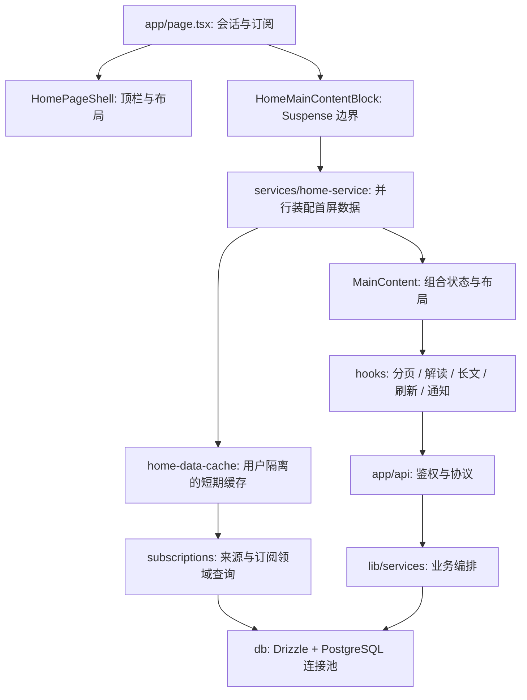

# 网站架构

## 边界与数据流

```mermaid
flowchart TD
  Page[app/page.tsx: 会话与订阅] --> Shell[HomePageShell: 顶栏与布局]
  Page --> Block[HomeMainContentBlock: Suspense 边界]
  Block --> Home[services/home-service: 并行装配首屏数据]
  Home --> Cache[home-data-cache: 用户隔离的短期缓存]
  Cache --> Subs[subscriptions: 来源与订阅领域查询]
  Subs --> DB[db: Drizzle + PostgreSQL 连接池]
  Home --> Main[MainContent: 组合状态与布局]
  Main --> Hooks[hooks: 分页 / 解读 / 长文 / 刷新 / 通知]
  Hooks --> API[app/api: 鉴权与协议]
  API --> Services[lib/services: 业务编排]
  Services --> DB
```

`app/page.tsx` 使用动态渲染，因为 `/` 依赖 NextAuth 会话。会话在当前 React 服务端请求中去重；个性化数据缓存的键含用户 ID，不缓存整页身份信息。

`home-service.ts` 并行获取 feed、来源元数据和收藏，复用已取得的 feed 生成第一页。`HomeMainContentBlock` 只把服务端 DTO 传给 `MainContent`，通过 Suspense 支持流式显示外壳。

## 客户端模块

所有全局 UI 状态仍归属于 `MainContent` 及其调用的 hooks；叶子列表通过 props 接收数据。`HomeLayoutContext` 只协调顶部按钮与侧栏/登录弹窗。

| 模块 | 职责 |
|---|---|
| `useFeedPagination` | 服务端游标偏移、过滤页、请求取消、跨预览全文搜索匹配 |
| `useInsightPanel` | 解读缓存、显式重试、预取、面板开合与请求清理 |
| `useLongformFeed` | 长文分页和全文按需读取、导入、失败状态 |
| `useRefreshTask` | 更新任务启动、取消、任务状态与完成通知 |
| `useModalFocus` | 弹窗焦点边界、Escape、滚动锁定和焦点恢复 |
| `useSubscribedFeedSync` | 订阅变动后同步来源与 feed；旧同步响应失效 |
| `useFeedBadges` | 本轮新增标记、已读清除和排序优先级 |
| `useFeedScroll` | 主列滚动与侧栏滚轮委托 |
| `useSourceActivity` | 临时通知与定时器生命周期 |
| `useBookmark` / `useSubscription` | 收藏与订阅的乐观更新 |

重型弹窗与长文模块继续通过 `next/dynamic` 加载；已移除首页定时预加载多个未打开面板的行为。主要布局、Tailwind tokens、SVG 与统一弹窗动画保持原样。

`ReadingPreferencesPanel` 只展示真正执行的三种阅读偏好，并容纳订阅管理与个人隐藏记录入口。旧 `FetchPipelinePanel` 已删除，采集参数、全站开关、审核及长文导入迁至受管理员权限保护的 `/admin/pipeline`。个人恢复只写用户反馈，不重新抓取、调用 AI 或改写共享新闻。历史停用规则仍保留在数据库，但不占新偏好容量。

## 数据和性能约定

- `lib/types.ts` 是共享新闻与来源 DTO 的入口。数据库模型在 `lib/db/schema.ts`。
- `NEWS_ITEMS_FEED_COLUMNS` 与 `mapNewsRowToItem` 共用，避免详情和订阅查询各维护一份转换逻辑。
- `filterFeedPosts`、`makeFilteredFeedPage`、`parseFeedPageQuery` 供页面与 API 共用。服务端先匹配全文再截短预览；客户端保留服务端返回的匹配 ID。
- 每次信息流最多读取 `FEED_CANDIDATE_LIMIT` 个候选（默认 1000，上限 5000），再执行既有评分、来源多样性和去重规则。客户端每页默认 12、最多 40 条。
- 推荐首屏与后续页使用同一个候选范围，排序增加 ID 作为并列项决胜条件。当前仍为 offset 分页；后台插入、删除或排序规则变更时应重新同步第一页，不提供跨数据变更的不可变快照。
- `news-dedupe.ts` 对每条内容只构建一次事件 token，并使用倒排索引定位比较候选；保持原有 first-wins、精确身份、指纹和 72 小时事件窗口语义。
- 数据库连接池在热重载间复用，最多 10 个连接，连接超时 5 秒、语句超时 15 秒。首页只查询近 24 小时新增计数，移除未展示的全库计数；个人统计使用当前可见候选流。
- 空列表额外检查存储可用性（10 秒缓存）；`/api/feed` 和 `/api/me/subscribed-feed` 在数据库不可用时返回 503，UI 展示错误与显式重试，不伪装成更新中。
- 浏览或读取订阅不会自动触发抓取；自动长文发现默认关闭。注册时初始化默认订阅，后续取消所有订阅不会被首页自动恢复。
- 阅读时间窗口替换与偏好容量检查在同一个数据库事务中执行，通过用户范围的事务锁防止并发保存产生重复时间窗口。
- `watchTask` 串行轮询，支持取消、失败退避、404 终止与 20 分钟等待上限；页面卸载会终止请求和计时器。
- 来源/收藏/新闻写入后继续通过 `home-cache-invalidation.ts` 使短期缓存失效。当前标签跨用户失效；多实例高流量部署可改为按用户标签。

## API 和扩展入口

| 路径 | 作用 |
|---|---|
| `/api/feed` | 会话对应的分页信息流 |
| `/api/me/subscribed-feed` | 需要登录的订阅流，兼容旧无分页调用 |
| `/api/me/subscribed-sources` | 当前用户来源元数据 |
| `/api/recommended-sources` | 推荐来源；身份只取会话，不接受 query 冒充用户 |
| `/api/analysis`、`/api/analysis/prefetch` | 解读生成与已生成解读的批量读取 |
| `/api/longform/posts`、`/api/longform/posts/[id]` | 轻量长文列表与全文 |
| `/api/bookmarks`、`/api/subscriptions` | 需登录的收藏/订阅操作 |
| `/api/me/pipeline-rules` | 时间范围、屏蔽关键词、优先关键词；拒绝停用的通用规则 |
| `/api/me/pass-logs` | 默认仅个人隐藏记录；moderation 范围需管理员 |
| `/api/longform/import`、`/api/import-from-url` | 仅管理员可导入新内容 |
| `/api/longform/from-post` | 登录后按需提取现有新闻长文 |
| `/api/sources` | 创建需登录；全站修改、删除需管理员 |
| `/api/refresh`、`/api/refresh/cancel`、`/api/task-status` | 抓取任务和轮询 |
| `/api/internal/cron/*` | 外部定时调度入口 |

新增 AI 供应商实现 `lib/ai/ai-service.ts` 的接口，并在 factory 注册。新增采集平台走 ingest/import 服务，不在 React 组件中访问数据库。当前网页 scraper 分支不提供解析器，返回空列表并提示；已删除其无效的网络请求。

## 运行与验证边界

构建使用真实 Next.js 类型，不再维护旧版 `next/server.js` 声明补丁。`npm run typecheck` 额外检查无用变量和参数；`npm test` 使用 Node test runner、React DOM 与已有 jsdom，无数据库写入或 AI 调用。

`npm run test:integration` 只在显式配置隔离测试库 / 本地验证服务时执行。它覆盖隐藏恢复的用户隔离、数据库事务与 HTTP 权限；没有测试配置时跳过，不连接 `.env.local` 中的数据库。运行方法见功能调整记录。

生产数据不在 `data/` JSON 中。`data/sources.json` 是源码依赖，必须进入 Git 与 Docker 构建上下文。历史 JSON 流水线、日志、旧构建产物已清理；独立移动端项目保留。

抓取任务通过 `TaskManager` / `PostgresTaskStore` 保存至 `refresh_tasks`，`ownerId` 随任务 JSON 持久化。HTTP 查询与取消校验发起人；取消后的任务不会被迟到的结果改写为完成。`after()` 保持响应后的请求生命周期，抓取入口设置 300 秒平台上限。订阅补抓冷却仍是进程内提示，不是跨实例的强限流。

保留远程 main 的数据库读取瞬时错误重试、连接保活、本轮 rawIds 优先处理、AI 环境值清洗及降级逻辑。长文每页默认 12 条，按发布时间与 ID 稳定排序，客户端按服务端 nextOffset 继续读取。实际长任务吞吐、平台时限、数据保留周期和 AI 质量仍需部署环境测量。
